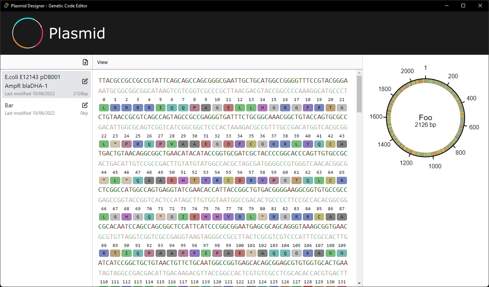

# Plasmid Designer
[![badge_release]][link_latest_release] ![badge_platforms] ![badge_lint]

__Plasmid Designer is a work-in-progress.__

Many features aren't implemented yet and there might still be issues with some basic features, although the editor itself should work fairly well at this point.

Feel free to give it a try and open an issue if you encounter bugs or want to request a feature!

### Roadmap

The roadmap can be found here: [Plasmid Designer Roadmap](https://github.com/orgs/plasmid-designer/projects/1/views/1)

## What is it?

Plasmid Designer is a __free and open source__ tool for DNA editing and plasmid design. It's meant to provide an easy and frictionless entry into the world of genetic engineering.

The primary goal of Plasmid Designer is to be beginner friendly and provide a great out-of-the-box experience. Even though the focus is on beginners, we're planning to add many features that experts will love, such as GenBank® integration and support for various industry-standard file formats.

## Screenshots

<!-- Badges -->
[badge_lint]: https://img.shields.io/github/workflow/status/plasmid-designer/plasmid-designer/Lint/main?label=lint&style=flat-square
[badge_release]: https://img.shields.io/github/v/release/plasmid-designer/plasmid-designer?color=informational&sort=semver&style=flat-square
[badge_platforms]: https://img.shields.io/badge/platforms-win%20%7C%20mac%20%7C%20linux-informational?style=flat-square

<!-- Links -->
[link_latest_release]: https://github.com/plasmid-designer/plasmid-designer/releases/latest
